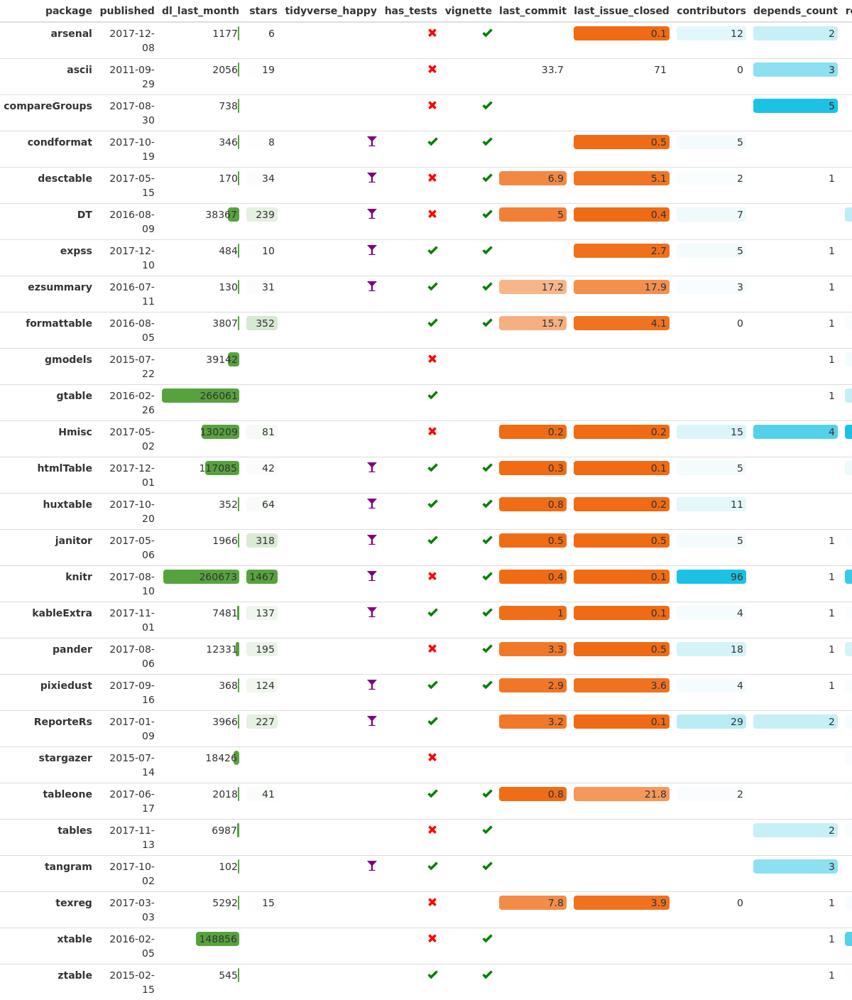

packagemetrics
================

About packagemetrics
--------------------

The packagemetrics project was a part of the 2017 rOpenSci Unconference. With over 10,000 packages on CRAN - and thousands more on GitHub and Bioconductor - a useR needs a way to navigate this wealth of options. There are many existing tools that are helpful for finding packages, but few ways to quickly compare differences between packages. We set out to create tools for comparing a set of related and potentially overlapping packages through a combination of standardized packagemetrics and an expert review process. More information about our project can be found in this [post](https://ropensci.org/blog/blog/2017/06/27/packagemetrics).

Team packagemetrics:
--------------------

Lori Shepherd, Hannah Frick, William Ampeh, Erin Grand, Sam Firke, Becca Krouse

Installation
------------

``` r
devtools::install_github("ropenscilabs/packagemetrics")
```

Use
---

**Comparing dplyr and data.table:**

``` r
library(packagemetrics)
library(dplyr)

dplyr_and_dt <- package_list_metrics(c("dplyr", "data.table"))
glimpse(dplyr_and_dt)
```

    ## Observations: 2
    ## Variables: 18
    ## $ package            <chr> "dplyr", "data.table"
    ## $ published          <chr> "2017-09-28", "2017-10-27"
    ## $ title              <chr> "A Grammar of Data Manipulation", "Extensio...
    ## $ depends_count      <int> 1, 1
    ## $ suggests_count     <int> 17, 18
    ## $ tidyverse_happy    <lgl> TRUE, FALSE
    ## $ has_vignette_build <lgl> TRUE, TRUE
    ## $ has_tests          <lgl> TRUE, TRUE
    ## $ reverse_count      <int> 677, 377
    ## $ dl_last_month      <dbl> 393520, 286717
    ## $ ci                 <chr> "Travis, Appveyor", "NONE"
    ## $ test_coverage      <chr> "CodeCov", NA
    ## $ forks              <dbl> 836, 650
    ## $ stars              <dbl> 2097, 1253
    ## $ watchers           <dbl> 236, 156
    ## $ last_commit        <dbl> 0.66666667, 0.06666667
    ## $ last_issue_closed  <dbl> 0.06666667, 0.10000000
    ## $ contributors       <dbl> 136, 43

### Creating a pretty metrics\_table

Here's a comparison of popular table-making packages, using the `metrics_table` function:

``` r
pkg_df <- package_list_metrics(table_packages) # included vector of table pkgs
ft <- metrics_table(pkg_df)
```



Refreshing data sources
-----------------------

If the cached CRAN data gets out of date, call `get_cran(forget = TRUE)` to force refreshing. This will fetch the latest results from CRAN and cache them for use going forward.

GitHub data is scraped at the time of the call to `package_list_metrics`.

Requirements
------------

`packagemetrics` requires R version &gt;= 3.4.0.
